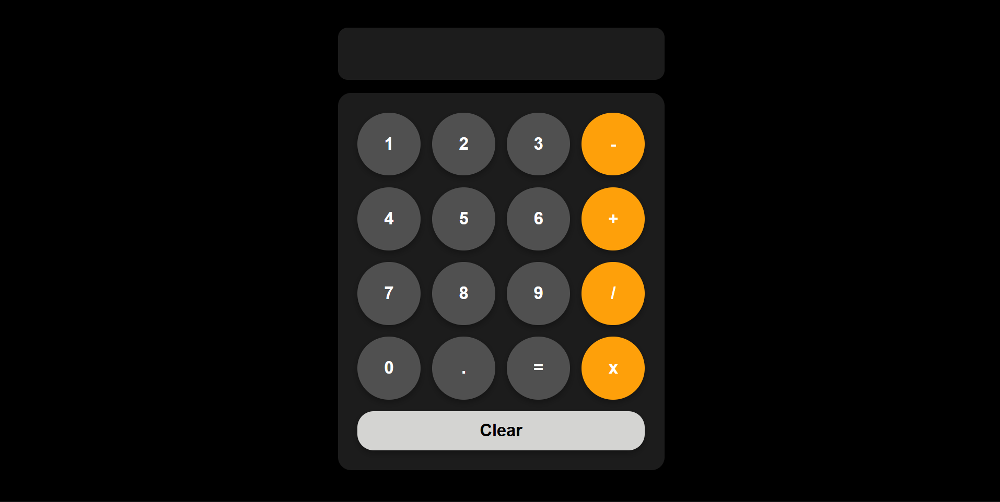

# Simple Calculator

My very first JavaScript project - a functional calculator that actually works!




## 🎯 Project Purpose

**What**: A basic calculator that performs addition, subtraction, multiplication, and division with a clean, iOS-inspired design.

**Why**: This was my **first hands-on JavaScript project** while following the SuperSimpleDev YouTube tutorial. I wanted to build something real and functional to understand how JavaScript actually works in the browser.

**Learning Goals**:
- Write my first JavaScript functions
- Understand event listeners and `onclick()` 
- Learn how `localStorage` works (still getting the hang of it!)
- Build something that actually works and I can use

## 🛠️ Built With

- HTML5
- CSS3 (Grid, Flexbox, Media Queries)
- Vanilla JavaScript
- localStorage API

## ✨ Features

- ✅ Basic arithmetic operations (+, -, ×, ÷)
- ✅ Decimal number support
- ✅ Calculation persistence (survives page refresh)
- ✅ Responsive design (mobile to desktop)
- ✅ iOS calculator-inspired UI
- ✅ Real-time calculation display

## 💭 Development Journey

### The Proudest Moment 🎉

The first time I used this calculator to perform a mathematical operation, I felt SO much joy! Seeing something I created actually work and do what it's supposed to do was an incredible feeling. It made all the struggle worth it.

### Challenges & How I Tackled Them

**Problem**: Getting the functions to work properly  
**Reality**: As my first JavaScript project, understanding function syntax and how they execute was tough. The logic didn't click immediately.  
**What I Did**: Followed the tutorial step-by-step, tested each button individually, and slowly started to understand how the `updateCalculation()` function adds values and updates the display.

**Problem**: The `onclick()` event listener was confusing  
**Reality**: I was still very new to JavaScript logic. Understanding how clicking a button triggers a function, and how to pass values to that function felt overwhelming at first.  
**What I Did**: Wrote it out multiple times, tested with different buttons, and eventually it started making sense - the browser listens for clicks, then runs the code inside.

**Problem**: localStorage was tricky  
**Reality**: Honestly, I haven't fully gotten the hang of it yet. Understanding how data persists in the browser and when to save/load it is still a bit confusing.  
**What I Know Now**: I know it saves the calculation even after closing the browser, which is cool! With more projects, I'll master it.

### Key Learnings

1. **Functions**: How to create functions and call them when events happen
2. **The DOM**: How `document.querySelector()` finds elements on the page
3. **Event Handling**: How `onclick` connects HTML buttons to JavaScript functions
4. **localStorage basics**: How `getItem()` retrieves data and `setItem()` saves it (still learning!)
5. **String concatenation**: How `+=` adds values to the calculation string
6. **eval()**: A function that can calculate mathematical expressions from strings

### Code I'm Proud Of

```javascript
let calculation = localStorage.getItem('calculation') || '';
```

**Why this matters to me**: This single line does TWO things at once - it tries to get saved data, and if there's nothing saved, it starts with an empty string. Even though I'm still learning localStorage, seeing this work felt like magic. The `||` operator is something I'll definitely use again.

```javascript
function updateCalculation(value) {
   calculation += value;
   showCalculation();
   localStorage.setItem('calculation', calculation);
}
```

**Why this matters to me**: This is my first real JavaScript function that I understand! It takes a value (like '5' or ' + '), adds it to the calculation, shows it on screen, and saves it. Breaking it down into these three simple steps helped me understand how functions work.

## 🔄 What's Next

Things I want to learn and add:
- [ ] Add keyboard support (so I can type numbers instead of clicking)
- [ ] Make a backspace button (to fix mistakes)
- [ ] Learn better ways to calculate without `eval()`
- [ ] Add a history feature to see past calculations
- [ ] Build more projects to truly master localStorage

## 🚦 Run Locally

```bash
# Clone the repository
git clone https://github.com/your-username/simple-calculator.git

# Navigate to folder
cd simple-calculator

# Open in browser
# Just double-click index.html or use Live Server in VS Code
```

## 📂 File Structure

```
simple-calculator/
├── index.html      # Calculator structure and onclick events
├── styles.css      # All the styling and responsive design
├── script.js       # My first JavaScript functions!
└── README.md
```

## 📚 Resources That Helped Me

- [SuperSimpleDev JavaScript Tutorial](https://www.youtube.com/supersimpledev) - The tutorial I followed to build this
- [MDN JavaScript Basics](https://developer.mozilla.org/en-US/docs/Learn/Getting_started_with_the_web/JavaScript_basics) - For understanding functions
- [W3Schools onclick](https://www.w3schools.com/jsref/event_onclick.asp) - Helped me understand event listeners

## 🤔 Reflections

**What Went Well**: I built something that works! It's not perfect, but it does what a calculator should do, and I'm proud of that.

**What Was Hard**: Pretty much everything at first. JavaScript logic is different from HTML/CSS. But it got easier as I kept practicing.

**What's Next For Me**: More JavaScript projects! I need more practice with functions, event listeners, and especially localStorage. Each project will make me better.

---

**My First JavaScript Project** | SuperSimpleDev Tutorial | December 2024

*"The joy of seeing your first working project is unmatched!"*